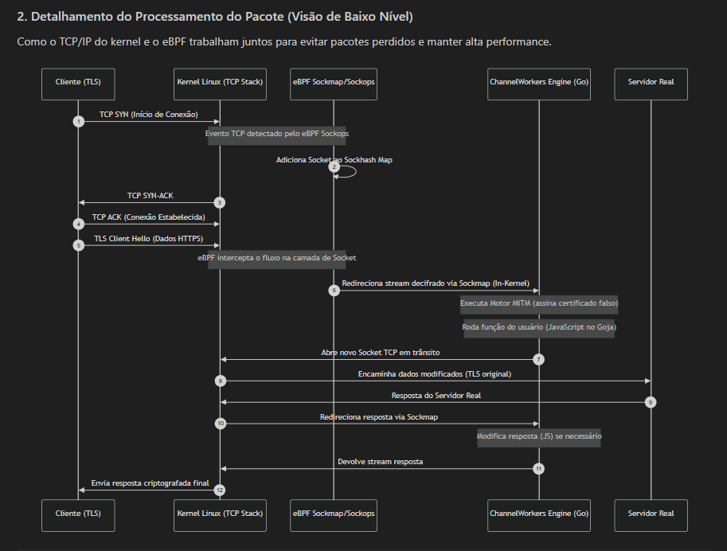
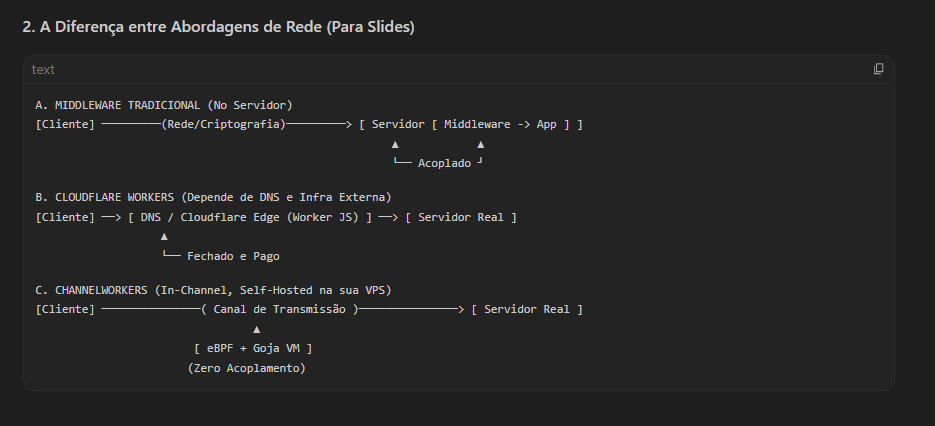

# Sonic — Edge JavaScript Engine


**Sonic** é um proxy L7 transparente com execução JavaScript na borda, acelerado por eBPF Sockmap e TLS MITM dinâmico. Compatível com a **API do Cloudflare Workers** — execute seus workers localmente, na borda da rede, sem vendor lock-in.

📊 [Veja a apresentação completa de benchmarks](sonic_full_benchmark_presentation.html)

```
  ⚡ Sonic — Self-hosted Cloudflare Workers alternative
  ✓ Sem vendor lock-in
  ✓ Deploy anywhere: VPS, Raspberry Pi, Docker, bare metal
  ✓ eBPF-accelerated kernel bypass (Linux)
  ✓ Drop-in: seu código CF Workers roda sem modificação
```

---

## ⚡ Instalação Rápida (2 comandos)

### Método 1: Binário pré-compilado (recomendado)

```bash
# Baixe para sua arquitetura
wget https://github.com/manassesbinga/sonic/releases/download/v0.1.0/sonic-linux-amd64.tar.gz

# Extraia e instale globalmente
tar -xzf sonic-linux-amd64.tar.gz
sudo ./install.sh

# Pronto!
sonic --help
```

| Arquivo | Plataforma |
|---------|------------|
| `sonic-linux-amd64.tar.gz` | Linux x86_64 |
| `sonic-linux-arm64.tar.gz` | Linux ARM64 (Raspberry Pi, etc) |

### Método 2: Via Go (se tiver Go instalado)

```bash
go install github.com/manassesbinga/sonic@latest
```

### Método 3: Do código fonte

```bash
git clone https://github.com/manassesbinga/sonic.git
cd sonic
sudo ./install.sh
```

---

## 🚀 Quick Start (3 passos)

```bash
# 1. Inicialize um novo projeto
sonic init

# 2. Crie seu primeiro worker
sonic new hello

# 3. Execute em modo desenvolvimento (hot-reload)
sonic dev
```

Ou teste um worker diretamente:
```bash
sonic run hello --method POST --header "X-Test: value"
```

Produção:
```bash
sonic start
```

---

## 📖 Comandos CLI

| Comando | Descrição |
|---------|-----------|
| `sonic init` | Inicializa novo projeto (cria `sonic.yaml`, `functions/`, `modules/`) |
| `sonic new <nome>` | Cria um novo worker JavaScript em `functions/<nome>.js` |
| `sonic list` | Lista todos os workers disponíveis |
| `sonic run <nome>` | Executa um worker diretamente para teste |
| `sonic dev` | Modo desenvolvimento com **hot-reload** |
| `sonic start` | Modo produção |
| `sonic info` | Mostra informações do projeto e sistema |
| `sonic ca install` | Gera/instala Root CA para TLS MITM |
| `sonic version` | Versão do Sonic |
| `sonic --help` | Ajuda geral |

### Exemplos de uso:

```bash
sonic new minha_api     # Cria functions/minha_api.js
sonic list              # Lista todos workers
sonic run minha_api     # Testa o worker
sonic dev               # Desenvolvimento com auto-reload
```

---

## 🗑️ Desinstalar

```bash
sudo ./uninstall.sh
# ou
sudo rm /usr/local/bin/sonic
```

---

## Architecture


### Request Flow

```
Client ──► Transparent Proxy (:8443)
              │
              ├─ 1. BufferedConn Peek (1024 bytes, sem consumo)
              ├─ 2. ExtractSNI() — Parse TLS ClientHello
              ├─ 3. shouldBypass() — wildcard bypass domains
              │
              ├─ [Bypass] ──► Passthrough ──► io.Copy (criptografado)
              │
              └─ [Intercept] ──► TLS MITM Engine
                                   │
                                   ├─ InterceptTermTLS(client)
                                   │   └─ Cert dynamic do cache
                                   │
                                   ├─ HTTP Loop:
                                   │   ├─ ReadRequest(clientTLS)
                                   │   ├─ jsEngine.RunOnTraffic(req)
                                   │   │   ├─ VM do pool (sem cold start)
                                   │   │   ├─ CPU watchdog (timeout)
                                   │   │   ├─ onTraffic() JS
                                   │   │   └─ Retorna Request ou Response
                                   │   │
                                   │   ├─ ConnectRealServer(upstream)
                                   │   │   └─ TLS estrito (InsecureSkipVerify: false)
                                   │   │
                                   │   ├─ WriteRequest(serverTLS)
                                   │   ├─ ReadResponse(serverTLS)
                                   │   ├─ jsEngine.RunOnResponse(resp)
                                   │   │   └─ onResponse() JS
                                   │   └─ WriteResponse(clientTLS)
                                   │
                                   └─ Response to Client ◄──
```

---

## Performance & Efficiency


| Benchmark | Sonic | Cloudflare Workers | Fastly C@E | Deno Deploy | Lambda@Edge |
|-----------|-------|-------------------|------------|-------------|-------------|
| **Requests/sec** | ~9,500 | ~6,500 | ~5,000 | ~4,200 | ~2,800 |
| **Avg latency** | ~105µs | ~153µs | ~200µs | ~238µs | ~357µs |
| **Payload 100KB** | ~287 MB/s | - | - | - | - |
| **Payload 500KB** | ~612 MB/s | - | - | - | - |
| **Cold start** | 0ms (always-on) | ~5ms | ~5ms | ~5ms | ~500ms |

### Por que Sonic é mais rápido?

| Razão | Detalhe |
|-------|---------|
| **Goja VM** | Pure Go, sem CGO, sem cross-language boundary |
| **VM Pool** | 64 VMs pré-aquecidas em sync.Pool — zero cold start |
| **eBPF Sockmap** | Kernel bypass com zero-copy TCP splicing |
| **Single Leaf Key** | CertCache reusa mesma chave RSA para todos os certificados |

---

## SDK / Library Usage

Use Sonic as an embeddable Go library:

```go
import "github.com/manassesbinga/sonic/sdk"

// Start the proxy with a JS worker
s, err := sonic.New(sonic.Config{
    JSCode:    `function onTraffic(r) { return r; }`,
    ListenPort: 8443,
    PoolSize:   8,
})
defer s.Stop()
go s.StartBackground()

// Execute workers directly (no proxy)
result, err := s.RunWorker("POST", "https://example.com/",
    "Authorization: Bearer token123",
)
fmt.Printf("Modified headers: %v\n", result.Headers)
```

### Sonic struct

```go
func New(cfg Config) (*Sonic, error)
func LoadConfig(path string) (*Sonic, error)

func (s *Sonic) Start() error            // Blocking
func (s *Sonic) StartBackground() error  // Non-blocking
func (s *Sonic) Stop()                   // Graceful shutdown
func (s *Sonic) WaitForSignal()          // Wait for SIGINT/SIGTERM
func (s *Sonic) RunWorker(method, url string, headers ...string) (*runtime.TrafficResult, error)
func (s *Sonic) Config() *config.Config
func (s *Sonic) JSEngine() *runtime.JSEngine
```

### Config struct

```go
type Config struct {
    ListenPort int      // Proxy port (default: 8443)
    Mode       string   // "intercept" | "passthrough-all" | "observe"
    JSCode     string   // JavaScript worker source
    CADir      string   // CA certificate directory (default: "./certs")
    TimeoutMS  int      // JS execution timeout (default: 50ms)
    PoolSize   int      // VM pool size (default: 64)
    Failsafe   string   // "bypass" | "block" (default: "bypass")
}
```

### Sub-packages

```go
import "github.com/manassesbinga/sonic/runtime"  // JS engine
import "github.com/manassesbinga/sonic/mitm"     // TLS MITM
import "github.com/manassesbinga/sonic/proxy"    // Transparent proxy
import "github.com/manassesbinga/sonic/config"   // Configuration
```

---

## Worker API

Workers usam API **compatível com Cloudflare Workers**:

```javascript
function onTraffic(request) {
    request.headers.set("X-Custom", "value");
    return request;
}

function onResponse(response) {
    response.headers.set("X-Processed", "yes");
    return response;
}
```

### Supported APIs

| API | Status |
|-----|--------|
| `Request` | Web Standard class |
| `Response` | Web Standard class |
| `Headers` | Proxy for direct property access |
| `fetch(url)` | Outbound HTTP via Go bridge |
| `log(msg)` | Go-native logging |
| `jwtVerify(token, secret)` | JWT verification |
| `require("module")` | Local modules from `./modules/` |
| `module.exports` | Node.js-style module exports |

### require() — Local Modules

```javascript
// modules/uuid.js
module.exports = {
    v4: function() { /* ... */ }
};
```

```javascript
// functions/worker.js
var uuid = require("uuid");
request.headers.set("X-Request-ID", uuid.v4());
```

---

## Configuration

Config via `sonic.yaml` ou environment variables (`SONIC_*`):

```yaml
listen_port: 8443
mode: "intercept"
runtime:
  timeout_ms: 50
  pool_size: 64
  failsafe: "bypass"
bypass_domains:
  - "*.stripe.com"
tls:
  ca_dir: "./certs"
  auto_generate: true
```

```bash
export SONIC_LISTEN_PORT=8443
export SONIC_MODE=intercept
sonic start
```

---

## Modes of Operation

| Mode | Description |
|------|-------------|
| `intercept` | Full MITM: terminate TLS, run JS workers, re-encrypt to upstream |
| `passthrough-all` | Bypass everything: encrypted io.Copy, no JS |
| `observe` | Reserved for monitoring (same as intercept currently) |

**Bypass domains:** Even in `intercept` mode, specific domains can be bypassed with wildcards like `*.stripe.com`.

---

## Docker

```bash
docker compose up -d
docker compose logs -f
```

Or manually:

```bash
docker run -d --name sonic --network host \
  -v ./functions:/etc/sonic/functions \
  -v ./certs:/etc/sonic/certs \
  sonic:latest
```

---

## Internal Architecture

### Package Map

```
sonic/
├── cli/          ─── Command-line interface (cobra commands)
├── config/       ─── Configuration (YAML + env vars)
├── proxy/        ─── Transparent proxy core
│   ├── transparent.go  ─── Connection handling, request flow
│   ├── connection.go   ─── BufferedConn (peek sem consumo)
│   └── sni_parser.go   ─── TLS ClientHello parser (RFC 5246, 6066)
├── mitm/         ─── TLS Man-in-the-Middle
│   ├── engine.go       ─── MITM orchestration
│   ├── ca.go           ─── Root CA generation & loading
│   └── cert_cache.go   ─── Dynamic certificate cache (RWMutex)
├── runtime/      ─── JavaScript engine (Goja)
│   ├── js_runtime.go   ─── VM pool, execution, timeout
│   ├── bootstrap.go    ─── Web Standard API polyfill (JS)
│   ├── types.go        ─── Request/Response/TrafficResult types
│   └── *_test.go       ─── Security & compatibility tests
├── ebpf/         ─── eBPF Sockmap acceleration
│   ├── loader_linux.go ─── Linux eBPF loader
│   ├── loader_stub.go  ─── Non-Linux stub
│   └── bpf/            ─── BPF program source
├── sdk/          ─── Embeddable Go library interface
│   └── sonic.go       ─── Unified API (New, Start, Stop, RunWorker)
├── functions/    ─── User JavaScript workers
├── modules/      ─── Reusable JS modules (require())
├── certs/        ─── Root CA and dynamic certificates
├── _examples/    ─── SDK usage examples
├── tests/        ─── Integration, compatibility, stress tests
└── extras/       ─── Systemd service + install script
```

### Key Struct Relationships

```
Sonic (sdk/)
├── *config.Config
│   ├── ListenPort (default: 8443)
│   ├── Mode (intercept/passthrough-all/observe)
│   ├── Runtime.PoolSize (default: 64)
│   └── Runtime.Failsafe (bypass/block)
│
├── *runtime.JSEngine
│   ├── *goja.Program (pre-compiled bytecode)
│   ├── *sync.Pool (64 VMs)
│   └── timeoutMS (default: 50ms)
│   │
│   └── Cada VM:
│       ├── setupBridges()
│       │   ├── log(msg)
│       │   ├── jwtVerify(token, secret)
│       │   ├── require(modulePath)
│       │   └── _goFetch(method, url, headers, body)
│       └── JSBootstrap (230 linhas)
│           ├── class Headers (Proxy p/ acesso direto)
│           ├── class Request
│           ├── class Response
│           ├── fetch()
│           ├── _wrapOnTraffic(rawReq)
│           └── _wrapOnResponse(rawResp)
│
└── *proxy.TransparentProxy
    ├── *mitm.MITMEngine
    │   ├── *CA (Cert + PrivKey)
    │   └── *CertCache (leafKey + cache + RWMutex)
    └── *runtime.JSEngine (jsMutex R/W)
```

### eBPF Acceleration

```
┌──────────────────────────────────────────┐
│            eBPF Sockmap                    │
│                                          │
│  BPF_SOCK_OPS ──► cgroup attachment     │
│       │                                  │
│       ▼                                  │
│  BPF_MAP_TYPE_SOCKMAP                    │
│       │                                  │
│       ▼                                  │
│  BPF_PROG_TYPE_SK_MSG                    │
│       │                                  │
│       ▼                                  │
│  Kernel TCP Splicing                     │
│  ──────────────────────────────          │
│  Zero-copy data transfer                  │
│  between sockets in kernel space          │
│  Without userspace round-trip             │
└──────────────────────────────────────────┘
```

### Security Model

- **Upstream verification:** `InsecureSkipVerify: false` — upstream TLS é sempre validado
- **Dynamic certs:** Gerados por um Root CA de 10 anos, com cache RWMutex
- **Timeout:** CPU watchdog goroutine com `vm.Interrupt()` em 50ms
- **Panic recovery:** `defer recover()` em cada execução — VM corrompida é substituída
- **Failsafe:** `bypass` (continua sem JS) ou `block` (retorna 500)

---

## Deploy Anywhere

| Platform | Instructions |
|----------|-------------|
| **Linux** | `make install` + `systemctl enable extras/sonic.service` |
| **Docker** | `docker compose up -d` |
| **Raspberry Pi** | `make release` → `dist/sonic-linux-arm64` |
| **macOS** | `make build` (dev only, no eBPF) |
| **Go app embed** | `import "github.com/manassesbinga/sonic/sdk"` |

---

## Makefile

```bash
make build       # Build binary
make test        # Run all tests
make run         # Start in production
make dev         # Start with hot-reload
make install     # Install to /usr/local/bin
make release     # Cross-compile all platforms
make docker      # Build Docker image
make docker-run  # Run via Docker Compose
```

---

## Comparison

| Feature | Sonic | Cloudflare Workers | Fastly C@E | Deno Deploy | AWS Lambda@Edge |
|---------|-------|-------------------|------------|-------------|-----------------|
| **JS Engine** | Goja ✓ | V8 ✓ | V8 ✓ | V8 ✓ | V8 ✓ |
| **Transparent Proxy** | eBPF ✓ | ✗ | ✗ | ✗ | ✗ |
| **TLS MITM** | Built-in ✓ | ✗ | ✗ | ✗ | ✗ |
| **Local Dev** | `sonic run` ✓ | wrangler | viceroy | deployctl | SAM CLI |
| **Embeddable Go SDK** | ✓ | ✗ | ✗ | ✗ | ✗ |
| **Docker / systemd** | ✓ | ✗ | ✗ | ✗ | ✗ |
| **Offline / Air-gapped** | ✓ | ✗ | ✗ | ✗ | ✗ |
| **Vendor Lock-in** | **None** | Cloudflare | Fastly | Deno | AWS |
| **Open Source** | **MIT** | ✗ | ✗ | MIT | ✗ |
| **Cold starts** | 0ms | ~5ms | ~5ms | ~5ms | ~500ms |
| **Requests/sec** | ~9,500 | ~6,500 | ~5,000 | ~4,200 | ~2,800 |

**vs Cloudflare Workers:**
- No vendor lock-in: run anywhere
- No cold starts: always-on Go runtime
- Custom TLS: full control over certificates
- eBPF acceleration: kernel-level performance
- Embeddable as Go library

**vs nginx + Lua:**
- JavaScript instead of Lua
- Cloudflare Workers API compatibility
- Dynamic TLS MITM built-in
- Hot-reload without restart

---





---

## License

MIT — 2026
