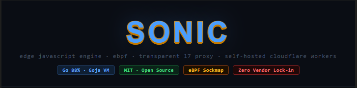

# Sonic — Multi-Language, Multi-Protocol Edge Engine



**Sonic** is a **platform for running logic over any network data**. Transparent L7 proxy, eBPF-accelerated, with support for multiple languages (JavaScript, WebAssembly) and protocols (HTTP, TCP, UDP, DNS, WebSocket, gRPC, QUIC). Compatible with **Cloudflare Workers API** — run your workers locally, at the network edge, without vendor lock-in.

## 🔮 The Vision

Sonic transforms from "just another JS proxy" to a **platform for running logic over ANY network data**, with three fundamental pillars:

1. **Any channel**: Protocol-agnostic (HTTP, TCP, UDP, DNS, WebSocket, gRPC, QUIC)
2. **Any language**: JavaScript (Goja), WebAssembly (Rust, Go, C), native via stdin/stdout
3. **Shared state**: Persistent KV Store (bbolt) for all workers, regardless of language/protocol


```
  ⚡ Sonic — Self-hosted Cloudflare Workers alternative
  ✓ No vendor lock-in
  ✓ Deploy anywhere: VPS, Raspberry Pi, Docker, bare metal
  ✓ eBPF-accelerated kernel bypass (Linux)
  ✓ Drop-in: your CF Workers code runs without modification
```


---

## ⚡ Quick Installation

---

## Script Structure
All scripts are organized in the `scripts/` folder:
```
scripts/
├── build-windows.ps1  # Build for Windows
├── build-linux.sh      # Build for Linux
├── windows/
│   ├── install.ps1     # Complete Windows installation (download + install)
│   └── uninstall.ps1   # Uninstall Windows
└── linux/
    ├── install.sh      # Complete Linux installation (download + install)
    └── uninstall.sh    # Uninstall Linux
```

---

### Windows
#### Option 1: Install latest version (online)
Open PowerShell as **ADMINISTRATOR** and run:
```powershell
powershell.exe -ExecutionPolicy Bypass -Command "Invoke-WebRequest -Uri 'https://raw.githubusercontent.com/manassesbinga/sonic/main/scripts/windows/install.ps1' -OutFile 'install-sonic.ps1'; .\install-sonic.ps1 -Version latest"
```

#### Option 2: Build and install locally
```powershell
# Build (optionally with -Release for optimized)
.\scripts\build-windows.ps1 -Release

# Install the local binary
.\scripts\windows\install.ps1
```

**Uninstallation:**
```powershell
.\scripts\windows\uninstall.ps1
```

---

### Linux
#### Option 1: Install latest version (online)
```bash
curl -fsSL https://raw.githubusercontent.com/manassesbinga/sonic/main/scripts/linux/install.sh -o install-sonic.sh
chmod +x install-sonic.sh
sudo ./install-sonic.sh --version latest
```

#### Option 2: Build and install locally
```bash
# Build (optionally with --release for optimized)
chmod +x scripts/build-linux.sh
./scripts/build-linux.sh --release

# Install the local binary
sudo ./scripts/linux/install.sh
```

**Uninstallation:**
```bash
sudo ./scripts/linux/uninstall.sh
```

---

### Alternative Method: Via Go (any OS)
```bash
go install github.com/manassesbinga/sonic@latest
```

---

## 🚀 Quick Start (3 steps)

```bash
# 1. Initialize a new project
sonic init

# 2. Create your first worker
sonic new hello

# 3. Run in development mode (hot-reload)
sonic dev
```

Or test a worker directly:
```bash
sonic run hello --method POST --header "X-Test: value"
```

Production:
```bash
sonic start
```

---

## 📖 CLI Commands

| Command | Description |
|---------|-------------|
| `sonic init` | Initialize new project (creates `sonic.yaml`, `functions/`, `modules/`) |
| `sonic new &lt;name&gt;` | Create a new JavaScript worker in `functions/&lt;name&gt;.js` |
| `sonic list` | List all available workers |
| `sonic run &lt;name&gt;` | Run a worker directly for testing |
| `sonic dev` | Development mode with **hot-reload** |
| `sonic start` | Production mode |
| `sonic info` | Show project and system information |
| `sonic ca install` | Generate/install Root CA for TLS MITM |
| `sonic version` | Sonic version |
| `sonic --help` | General help |

### Usage examples:

```bash
sonic new my_api     # Creates functions/my_api.js
sonic list              # List all workers
sonic run my_api     # Test the worker
sonic dev               # Development with auto-reload
```

---

## Architecture


### Request Flow

```
Client ──► Transparent Proxy (:8443)
              │
              ├─ 1. BufferedConn Peek (1024 bytes, no consumption)
              ├─ 2. ExtractSNI() — Parse TLS ClientHello
              ├─ 3. shouldBypass() — wildcard bypass domains
              │
              ├─ [Bypass] ──► Passthrough ──► io.Copy (encrypted)
              │
              └─ [Intercept] ──► TLS MITM Engine
                                   │
                                   ├─ InterceptTermTLS(client)
                                   │   └─ Cert dynamic from cache
                                   │
                                   ├─ HTTP Loop:
                                   │   ├─ ReadRequest(clientTLS)
                                   │   ├─ jsEngine.RunOnTraffic(req)
                                   │   │   ├─ VM from pool (no cold start)
                                   │   │   ├─ CPU watchdog (timeout)
                                   │   │   ├─ onTraffic() JS
                                   │   │   └─ Returns Request or Response
                                   │   │
                                   │   ├─ ConnectRealServer(upstream)
                                   │   │   └─ Strict TLS (InsecureSkipVerify: false)
                                   │   │
                                   │   ├─ WriteRequest(serverTLS)
                                   │   ├─ ReadResponse(serverTLS)
                                   │   ├─ jsEngine.RunOnResponse(resp)
                                   │   │   └─ onResponse() JS
                                   │   └─ WriteResponse(clientTLS)
                                   │
                                   └─ Response to Client ◄──
```

---

## Performance & Efficiency


| Benchmark | Sonic | Cloudflare Workers | Fastly C@E | Deno Deploy | Lambda@Edge |
|-----------|-------|-------------------|------------|-------------|-------------|
| **Requests/sec** | ~9,500 | ~6,500 | ~5,000 | ~4,200 | ~2,800 |
| **Avg latency** | ~105µs | ~153µs | ~200µs | ~238µs | ~357µs |
| **Payload 100KB** | ~287 MB/s | - | - | - | - |
| **Payload 500KB** | ~612 MB/s | - | - | - | - |
| **Cold start** | 0ms (always-on) | ~5ms | ~5ms | ~5ms | ~500ms |

### Why is Sonic faster?

| Reason | Detail |
|-------|---------|
| **Goja VM** | Pure Go, no CGO, no cross-language boundary |
| **VM Pool** | 64 pre-warmed VMs in sync.Pool — zero cold start |
| **eBPF Sockmap** | Kernel bypass with zero-copy TCP splicing |
| **Single Leaf Key** | CertCache reuses the same RSA key for all certificates |

---

## SDK / Library Usage

Use Sonic as an embeddable Go library:

```go
import "github.com/manassesbinga/sonic/sdk"

// Start the proxy with a JS worker
s, err := sonic.New(sonic.Config{
    JSCode:    `function onTraffic(r) { return r; }`,
    ListenPort: 8443,
    PoolSize:   8,
})
defer s.Stop()
go s.StartBackground()

// Execute workers directly (no proxy)
result, err := s.RunWorker("POST", "https://example.com/",
    "Authorization: Bearer token123",
)
fmt.Printf("Modified headers: %v\n", result.Headers)
```

### Sonic struct

```go
func New(cfg Config) (*Sonic, error)
func LoadConfig(path string) (*Sonic, error)

func (s *Sonic) Start() error            // Blocking
func (s *Sonic) StartBackground() error  // Non-blocking
func (s *Sonic) Stop()                   // Graceful shutdown
func (s *Sonic) WaitForSignal()          // Wait for SIGINT/SIGTERM
func (s *Sonic) RunWorker(method, url string, headers ...string) (*runtime.TrafficResult, error)
func (s *Sonic) Config() *config.Config
func (s *Sonic) JSEngine() *runtime.JSEngine
```

### Config struct

```go
type Config struct {
    ListenPort int      // Proxy port (default: 8443)
    Mode       string   // "intercept" | "passthrough-all" | "observe"
    JSCode     string   // JavaScript worker source
    CADir      string   // CA certificate directory (default: "./certs")
    TimeoutMS  int      // JS execution timeout (default: 50ms)
    PoolSize   int      // VM pool size (default: 64)
    Failsafe   string   // "bypass" | "block" (default: "bypass")
}
```

### Sub-packages

```go
import "github.com/manassesbinga/sonic/runtime"  // JS engine
import "github.com/manassesbinga/sonic/mitm"     // TLS MITM
import "github.com/manassesbinga/sonic/proxy"    // Transparent proxy
import "github.com/manassesbinga/sonic/config"   // Configuration
```

---

## Worker API

Workers use **Cloudflare Workers compatible API**:

```javascript
function onTraffic(request) {
    request.headers.set("X-Custom", "value");
    return request;
}

function onResponse(response) {
    response.headers.set("X-Processed", "yes");
    return response;
}
```

### Supported APIs

| API | Status |
|-----|--------|
| `Request` | Web Standard class |
| `Response` | Web Standard class |
| `Headers` | Proxy for direct property access |
| `fetch(url)` | Outbound HTTP via Go bridge |
| `log(msg)` | Go-native logging |
| `jwtVerify(token, secret)` | JWT verification |
| `require("module")` | Local modules from `./modules/` |
| `module.exports` | Node.js-style module exports |
| `kv` | Persistent KV Store (bbolt) for shared state |

### KV Store API (shared state)
JavaScript workers can read/write to the persistent KV Store:
```javascript
function onTraffic(request) {
  const ip = request.headers.get("X-Real-IP");
  
  // Read from KV
  const count = kv.get(`rate:${ip}`) || "0";
  
  if (parseInt(count) &gt; 100) {
    return new Response("Rate limited", { status: 429 });
  }
  
  // Write to KV
  kv.set(`rate:${ip}`, (parseInt(count) + 1).toString());
  
  return request;
}
```

Available methods:
- `kv.get(key)` → Returns the value (string) or ""
- `kv.set(key, value)` → Stores the value
- `kv.delete(key)` → Removes the key
- `kv.exists(key)` → Checks if the key exists
- `kv.keys()` → Returns array with all keys
- `kv.clear()` → Clears the entire KV Store

### require() — Local Modules

```javascript
// modules/uuid.js
module.exports = {
    v4: function() { /* ... */ }
};
```

```javascript
// functions/worker.js
var uuid = require("uuid");
request.headers.set("X-Request-ID", uuid.v4());
```

---

## Configuration

Config via `sonic.yaml` or environment variables (`SONIC_*`):

```yaml
listen_port: 8443
mode: "intercept"
runtime:
  timeout_ms: 50
  pool_size: 64
  failsafe: "bypass"
bypass_domains:
  - "*.stripe.com"
tls:
  ca_dir: "./certs"
  auto_generate: true
```

```bash
export SONIC_LISTEN_PORT=8443
export SONIC_MODE=intercept
sonic start
```

---

## Modes of Operation

| Mode | Description |
|------|-------------|
| `intercept` | Full MITM: terminate TLS, run JS workers, re-encrypt to upstream |
| `passthrough-all` | Bypass everything: encrypted io.Copy, no JS |
| `observe` | Reserved for monitoring (same as intercept currently) |

**Bypass domains:** Even in `intercept` mode, specific domains can be bypassed with wildcards like `*.stripe.com`.

---

## Docker

```bash
docker compose up -d
docker compose logs -f
```

Or manually:

```bash
docker run -d --name sonic --network host \
  -v ./functions:/etc/sonic/functions \
  -v ./certs:/etc/sonic/certs \
  sonic:latest
```

---

## Internal Architecture

### Package Map

```
sonic/
├── cli/          ─── Command-line interface (cobra commands)
├── config/       ─── Configuration (YAML + env vars)
├── proxy/        ─── Transparent proxy core
│   ├── transparent.go  ─── Connection handling, request flow
│   ├── connection.go   ─── BufferedConn (peek without consumption)
│   └── sni_parser.go   ─── TLS ClientHello parser (RFC 5246, 6066)
├── mitm/         ─── TLS Man-in-the-Middle
│   ├── engine.go       ─── MITM orchestration
│   ├── ca.go           ─── Root CA generation & loading
│   └── cert_cache.go   ─── Dynamic certificate cache (RWMutex)
├── runtime/      ─── JavaScript engine (Goja)
│   ├── js_runtime.go   ─── VM pool, execution, timeout
│   ├── bootstrap.go    ─── Web Standard API polyfill (JS)
│   ├── types.go        ─── Request/Response/TrafficResult types
│   └── *_test.go       ─── Security & compatibility tests
├── ebpf/         ─── eBPF Sockmap acceleration
│   ├── loader_linux.go ─── Linux eBPF loader
│   ├── loader_stub.go  ─── Non-Linux stub
│   └── bpf/            ─── BPF program source
├── sdk/          ─── Embeddable Go library interface
│   └── sonic.go       ─── Unified API (New, Start, Stop, RunWorker)
├── functions/    ─── User JavaScript workers
├── modules/      ─── Reusable JS modules (require())
├── certs/        ─── Root CA and dynamic certificates
├── _examples/    ─── SDK usage examples
├── tests/        ─── Integration, compatibility, stress tests
└── extras/       ─── Systemd service + install script
```

### Key Struct Relationships

```
Sonic (sdk/)
├── *config.Config
│   ├── ListenPort (default: 8443)
│   ├── Mode (intercept/passthrough-all/observe)
│   ├── Runtime.PoolSize (default: 64)
│   └── Runtime.Failsafe (bypass/block)
│
├── *runtime.JSEngine
│   ├── *goja.Program (pre-compiled bytecode)
│   ├── *sync.Pool (64 VMs)
│   └── timeoutMS (default: 50ms)
│   │
│   └── Each VM:
│       ├── setupBridges()
│       │   ├── log(msg)
│       │   ├── jwtVerify(token, secret)
│       │   ├── require(modulePath)
│       │   └── _goFetch(method, url, headers, body)
│       └── JSBootstrap (230 lines)
│           ├── class Headers (Proxy for direct access)
│           ├── class Request
│           ├── class Response
│           ├── fetch()
│           ├── _wrapOnTraffic(rawReq)
│           └── _wrapOnResponse(rawResp)
│
└── *proxy.TransparentProxy
    ├── *mitm.MITMEngine
    │   ├── *CA (Cert + PrivKey)
    │   └── *CertCache (leafKey + cache + RWMutex)
    └── *runtime.JSEngine (jsMutex R/W)
```

### eBPF Acceleration

```
┌──────────────────────────────────────────┐
│            eBPF Sockmap                    │
│                                          │
│  BPF_SOCK_OPS ──► cgroup attachment     │
│       │                                  │
│       ▼                                  │
│  BPF_MAP_TYPE_SOCKMAP                    │
│       │                                  │
│       ▼                                  │
│  BPF_PROG_TYPE_SK_MSG                    │
│       │                                  │
│       ▼                                  │
│  Kernel TCP Splicing                     │
│  ──────────────────────────────          │
│  Zero-copy data transfer                  │
│  between sockets in kernel space          │
│  Without userspace round-trip             │
└──────────────────────────────────────────┘
```

### Security Model

- **Upstream verification:** `InsecureSkipVerify: false` — upstream TLS is always validated
- **Dynamic certs:** Generated by a 10-year Root CA, with RWMutex cache
- **Timeout:** CPU watchdog goroutine with `vm.Interrupt()` in 50ms
- **Panic recovery:** `defer recover()` on each execution — corrupted VM is replaced
- **Failsafe:** `bypass` (continues without JS) or `block` (returns 500)

---

## Deploy Anywhere

| Platform | Instructions |
|----------|-------------|
| **Linux** | `make install` + `systemctl enable extras/sonic.service` |
| **Docker** | `docker compose up -d` |
| **Raspberry Pi** | `make release` → `dist/sonic-linux-arm64` |
| **macOS** | `make build` (dev only, no eBPF) |
| **Go app embed** | `import "github.com/manassesbinga/sonic/sdk"` |

---

## Makefile

```bash
make build       # Build binary
make test        # Run all tests
make run         # Start in production
make dev         # Start with hot-reload
make install     # Install to /usr/local/bin
make release     # Cross-compile all platforms
make docker      # Build Docker image
make docker-run  # Run via Docker Compose
```

---

## Comparison

| Feature | Sonic | Cloudflare Workers | Fastly C@E | Deno Deploy | AWS Lambda@Edge |
|---------|-------|-------------------|------------|-------------|-----------------|
| **JS Engine** | Goja ✓ | V8 ✓ | V8 ✓ | V8 ✓ | V8 ✓ |
| **Transparent Proxy** | eBPF ✓ | ✗ | ✗ | ✗ | ✗ |
| **TLS MITM** | Built-in ✓ | ✗ | ✗ | ✗ | ✗ |
| **Local Dev** | `sonic run` ✓ | wrangler | viceroy | deployctl | SAM CLI |
| **Embeddable Go SDK** | ✓ | ✗ | ✗ | ✗ | ✗ |
| **Docker / systemd** | ✓ | ✗ | ✗ | ✗ | ✗ |
| **Offline / Air-gapped** | ✓ | ✗ | ✗ | ✗ | ✗ |
| **Vendor Lock-in** | **None** | Cloudflare | Fastly | Deno | AWS |
| **Open Source** | **MIT** | ✗ | ✗ | MIT | ✗ |
| **Cold starts** | 0ms | ~5ms | ~5ms | ~5ms | ~500ms |
| **Requests/sec** | ~9,500 | ~6,500 | ~5,000 | ~4,200 | ~2,800 |

**vs Cloudflare Workers:**
- No vendor lock-in: run anywhere
- No cold starts: always-on Go runtime
- Custom TLS: full control over certificates
- eBPF acceleration: kernel-level performance
- Embeddable as Go library

**vs nginx + Lua:**
- JavaScript instead of Lua
- Cloudflare Workers API compatibility
- Dynamic TLS MITM built-in
- Hot-reload without restart

---

## 🚧 Public Roadmap

### v0.2 — Observability
- [ ] OpenTelemetry traces + Prometheus metrics
- [ ] Grafana dashboard included in `extras/grafana/`
- [ ] Structured logging (JSON)
- [ ] `/metrics` endpoint for Prometheus

### v0.3 — Storage
- [x] **Native KV Store (bbolt)** (embedded, zero external dependencies)
- [ ] Worker-level caching API
- [ ] TTL (Time-To-Live) for KV entries
- [ ] KV Store backup/restore

### v0.4 — Clustering
- [ ] Cluster mode via `hashicorp/memberlist` (gossip protocol)
- [ ] Distributed rate limiting
- [ ] Workers synchronized between nodes
- [ ] Distributed KV Store

### v0.5 — Runtime
- [ ] **WebAssembly worker support** (Rust, Go, C, AssemblyScript)
- [ ] Worker pipeline/composition (declarative via `sonic.yaml`)
- [ ] Native workers via stdin/stdout
- [ ] Integrated testing framework for workers

### v1.0 — Production Ready
- [ ] Full Cloudflare Workers API compatibility
- [ ] Security audit
- [ ] Load test suite (target: 50k req/s)
- [ ] mTLS + programmatic Certificate Pinning
- [ ] Production-ready cluster mode

---

## What makes a senior stop and star? 🤩

The **eBPF + WASM workers + distributed KV** combination doesn't exist in any open-source project! Sonic is the only proxy where you can:
- Write a worker in Rust (compiled to WASM)
- Share state with a JavaScript worker
- Intercept DNS and HTTP packets in the same pipeline
- All this at kernel speed via eBPF!

---

## License

MIT — 2026
