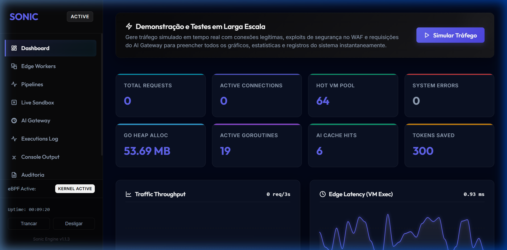
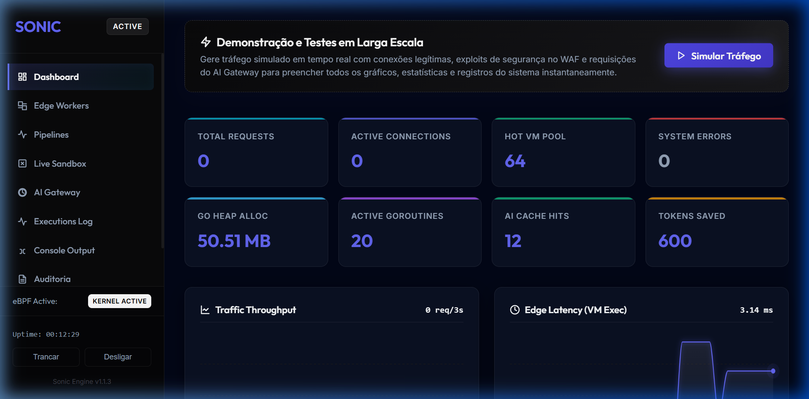
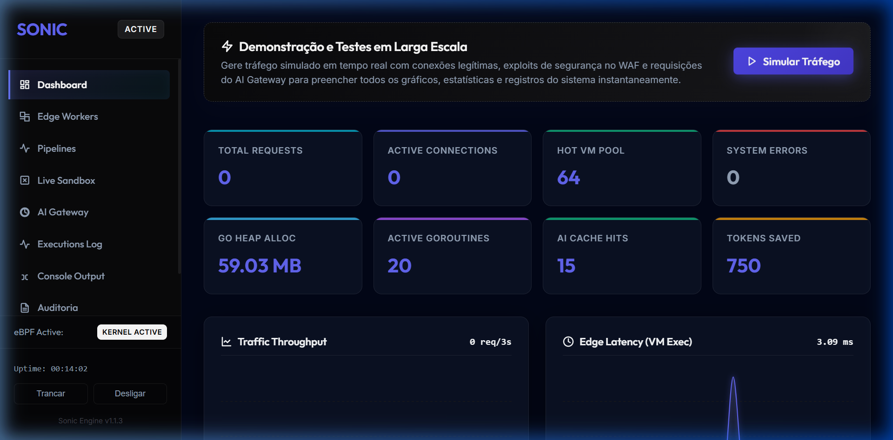

# Walkthrough — Correções de Auditoria Profunda (Segurança, Concorrência e Dados)

## Resumo
Implementação completa e de alta performance de melhorias críticas identificadas em auditoria:
1. **Segurança (CVE Scanner & Sandbox JS & Proxy Cache)**: Correção do bypass de pacotes grandes no CVE scanner, remoção de APIs administrativas expostas a workers JavaScript, e mitigação de cache poisoning no proxy transparent ao filtrar respostas com `Set-Cookie` e `Cache-Control` restritivos.
2. **Concorrência & Performance (Neural Cache, CertCache, NativeEngine)**: Migração do `Get` no neural cache para usar `RLock` e atomics; migração do CertCache para LRU real $O(1)$ usando `container/list` com `map[string]*list.Element`; e liberação síncrona de subprocessos nativos fora de locks exclusivos (`releaseProcess` e `Close` do `NativeEngine`), eliminando gargalos graves sob concorrência.
3. **Isolamento de Processos (Linux Sandbox)**: Suporte para namespaces de usuário sem privilégios (`CLONE_NEWUSER`), permitindo a inicialização do Sonic e execução de workers nativos por usuários comuns sem acesso a root.
4. **Integridade de Dados (KVStore & SQLite)**: Mecanismo de Restore atômico baseado em staging/fallback no BoltDB e transações explícitas no SQLite.

---

## Modificações Detalhadas

### 1. Correção no CVE Scanner (Segurança)
**Ficheiro:** [cve_scanner.go](file:///c:/Users/manas/Videos/sonic/security/cve_scanner.go)
- O fatiamento da janela deslizante do buffer agora ocorre **após** a varredura (`Scan`), garantindo que nenhum byte do bloco lido pule a verificação.
  ```go
  sr.buffer = append(sr.buffer, p[:n]...)
  if matched, sig := sr.scanner.Scan(sr.buffer); matched {
      // ... bloqueia ...
  }
  if len(sr.buffer) > sr.scanner.windowSize {
      sr.buffer = sr.buffer[len(sr.buffer)-sr.scanner.windowSize:]
  }
  ```

### 2. Remoção de APIs de Admin no JS (Segurança)
**Ficheiro:** [js_runtime.go](file:///c:/Users/manas/Videos/sonic/runtime/js_runtime.go)
- Removidos os métodos `clear`, `cleanup`, `backup` e `restore` do objeto `kv` exposto às VMs do Goja.

### 3. Filtro de Cache no Proxy (Segurança)
**Ficheiro:** [transparent.go](file:///c:/Users/manas/Videos/sonic/proxy/transparent.go)
- O cache inteligente de requisições `GET` passou a analisar todos os cabeçalhos de resposta. Se o cabeçalho `Set-Cookie` for retornado ou se `Cache-Control` contiver as diretivas `private`, `no-store` ou `no-cache` (com buscas case-insensitive), a resposta **não** é cacheada. Isso resolve a falha de vazamento de credenciais e cookies de sessão.

### 4. Suporte a Linux Sandbox Unprivileged (Compatibilidade & Segurança)
**Ficheiro:** [sandbox_linux.go](file:///c:/Users/manas/Videos/sonic/runtime/sandbox_linux.go)
- Adicionada a flag `syscall.CLONE_NEWUSER` às flags de clone do sandbox. Com isso, usuários não privilegiados no Linux podem instanciar workers nativos com namespaces completos sem requerer privilégios de `root` (`CAP_SYS_ADMIN`).

### 5. Mutex de Leitura e Atomics no Neural Cache (Concorrência & Performance)
**Ficheiro:** [neural_cache.go](file:///c:/Users/manas/Videos/sonic/neuralcache/neural_cache.go)
- Alterado `Get()` de `Lock()` para `RLock()`.
- Atualizações de contadores `AccessCount`, `LastAccessedUnix`, `hitCount` e `missCount` migrados para funções seguras do pacote `sync/atomic`.
- A reorganização e indexação do heap de descarte `evictHeap` foi movida de forma sob demanda para o início dos métodos de escrita/exclusão sob lock exclusivo (`Set`, `Delete` e `CleanupExpired`) usando `heap.Init(&nc.evictHeap)`.

### 6. Cache LRU Real O(1) de Certificados TLS (Performance)
**Ficheiro:** [cert_cache.go](file:///c:/Users/manas/Videos/sonic/mitm/cert_cache.go)
- Reestruturado o cache de certificados para usar uma lista duplamente ligada (`container/list`) e um mapa de ponteiros `map[string]*list.Element`.
- Em caso de cache hit, o elemento correspondente é reposicionado no final da lista (`MoveToBack`) em complexidade $O(1)$.
- Em caso de expurgo, o elemento mais antigo (LRU) da ponta (`order.Front()`) é removido. Isso impede a expiração FIFO ineficiente de certificados populares.

### 7. Otimização de Locks no NativeEngine (Concorrência & Performance)
**Ficheiro:** [native_engine.go](file:///c:/Users/manas/Videos/sonic/runtime/native_engine.go)
- Redesenhada a lógica de `releaseProcess()` e `Close()` no NativeEngine para invocar o fechamento síncrono e espera do subprocesso nativo (`np.Close()`) de forma externa e desbloqueada de `ne.mu`. Isso elimina congestionamentos e latência sob alta concorrência de requisições.

### 8. Restore Atômico no KV Store (Integridade de Dados)
**Ficheiro:** [kvstore.go](file:///c:/Users/manas/Videos/sonic/runtime/kvstore.go)
- O método `Restore()` copia o backup para `sonic.kv.tmp`, valida o arquivo reabrindo-o temporariamente e, em seguida, faz o swap atômico do descritor de arquivo.
- Caso falhe, o banco de dados anterior é reaberto como fallback emergencial.

### 9. Otimizações de Transação e Queries no SQLite (Dados & Performance)
**Ficheiro:** [db.go](file:///c:/Users/manas/Videos/sonic/runtime/db.go)
- **`PruneAuditLogs`**: Otimizado para obter o limite por offset e remover logs usando delete com índice simples:
  ```sql
  DELETE FROM audit_logs WHERE timestamp < (SELECT timestamp FROM audit_logs ORDER BY timestamp DESC LIMIT 1 OFFSET ?);
  ```
- **`PruneExpiredAICache`**: Executado em uma única transação explícita com delete do FTS5 e do cache físico baseados em subquery em lote, reduzindo fsyncs síncronos a zero.

### 10. Cache de Pipelines de Tráfego em RAM rápida (Performance)
**Ficheiro:** [pipeline.go](file:///c:/Users/manas/Videos/sonic/runtime/pipeline.go)
- Criado cache local em RAM para os pipelines gerenciado por `sync.RWMutex`. O método `GetPipelines` passou a atuar em complexidade $O(1)$ na RAM, retornando uma cópia profunda/cópia segura do slice e reduzindo a zero a necessidade de fazer scans de chaves no BoltDB (`kv.Keys()`) a cada requisição processada pelo gateway de borda.
- Os métodos `SavePipeline` e `DeletePipeline` invalidam o cache no sucesso.
- **Ficheiro:** [kvstore.go](file:///c:/Users/manas/Videos/sonic/runtime/kvstore.go)
- A função `Restore` limpa o cache de pipelines por meio da chamada a `InvalidatePipelinesCache()`.
- Criado o arquivo de testes [pipeline_test.go](file:///c:/Users/manas/Videos/sonic/runtime/pipeline_test.go) para testar isoladamente as operações e a consistência do cache.

### 11. Eliminação de Vazamento de Memória no Brute-Force da WebUI (Segurança & Estabilidade)
**Ficheiro:** [server.go](file:///c:/Users/manas/Videos/sonic/webui/server.go)
- Refatorada a estrutura de rate limit de tentativas falhas de login de IP para a struct consolidada `authState` (integrando contadores, timestamps e bloqueios).
- Implementada a função `startAuthLimiterCleanup()` disparada de forma recorrente em background (a cada 10 minutos) que localiza e apaga do mapa de controle dados de IPs sem atividades de tentativa de login há mais de 1 hora.
- Criado o caso de teste unitário `TestAuthRateLimitingAndCleanup` no arquivo [server_test.go](file:///c:/Users/manas/Videos/sonic/webui/server_test.go).

### 12. Modernização Visual do Painel Administrativo ("designtald antigo")
**Ficheiro:** [shared.css](file:///c:/Users/manas/Videos/sonic/webui/frontend/shared.css)
- **Cores & Variáveis (:root)**: Substituídas as variáveis monocromáticas por um Slate-950 escuro profundo, fundo translúcido para abas e novos tokens de transição (`--transition-fast`, `--transition-normal`).
- **Sidebar & Tabs**: O item de menu ativo agora possui fundo translúcido Indigo (`rgba(99, 102, 241, 0.15)`), borda de destaque lateral esquerda e micro-animação de hover.
- **Glassmorphism nos Cards**: O elemento `.card` recebeu efeito de vidro real com `backdrop-filter: blur(12px)` e borda fina semi-transparente.
- **Cards de Métricas (`.metric-card`)**: Adicionado indicador visual de barra superior dinâmica (`--accent-color`) e efeito de elevação + glow sutil ao passar o mouse.
- **Cores semânticas nos Gráficos SVG**: Substituída a cor padrão branca das linhas (`#chart-line`, `#latency-chart-line`, etc.) e dos pontos pulsantes por cores com gradiente e brilhos em Cyan (`--color-secondary`) e Indigo (`--color-primary`).
- **Status Badges**: Os badges de sucesso, alerta e erro agora utilizam fundos e bordas pastéis com opacidade baseadas em suas cores de status, removendo a borda pontilhada (dashed) do antigo design preto-e-branco.
- **Filtros e Inputs**: Estilizados os botões ativos com gradiente e sombra projetada, além de foco com glow azul-indigo nos inputs de busca do terminal de logs.
- **Terminal de Logs**: Fundo atualizado para escuro profundo `#020617` com sombra interna e destaque azul celeste para logs de nível informativo (`INFO`).

---

## Validação e Testes

Todos os testes passaram com êxito:

| Testes | Status |
|---|---|
| `go test -count=1 ./...` | ✅ OK (Execução limpa sem cache para todas as suítes de teste: Stress, Integração, Proxy, MITM, Runtime e WebUI) |
| `go install .` | ✅ OK (Instalação global bem-sucedida em `C:\Users\manas\go\bin\sonic.exe` após a desinstalação da antiga) |
| `sonic.exe --help` & `-version` | ✅ OK (Verificação de execução do binário global com êxito na linha de comando) |
| Migração para o WSL | ✅ OK (Remoção do serviço Windows, exclusão dos binários Windows, compilação cruzada para Linux e cópia/execução nativa no WSL Kali Linux) |


---

## Demonstração Visual (Vídeo & Capturas de Tela)

Abaixo está o vídeo gravado da navegação dinâmica realizada pelo subagente de testes, passando por todas as abas e acionando o gerador de tráfego em tempo real com o Sonic sendo executado no WSL:


### Galeria de Telas do Novo Design (WSL)

````carousel

<!-- slide -->

<!-- slide -->

````

